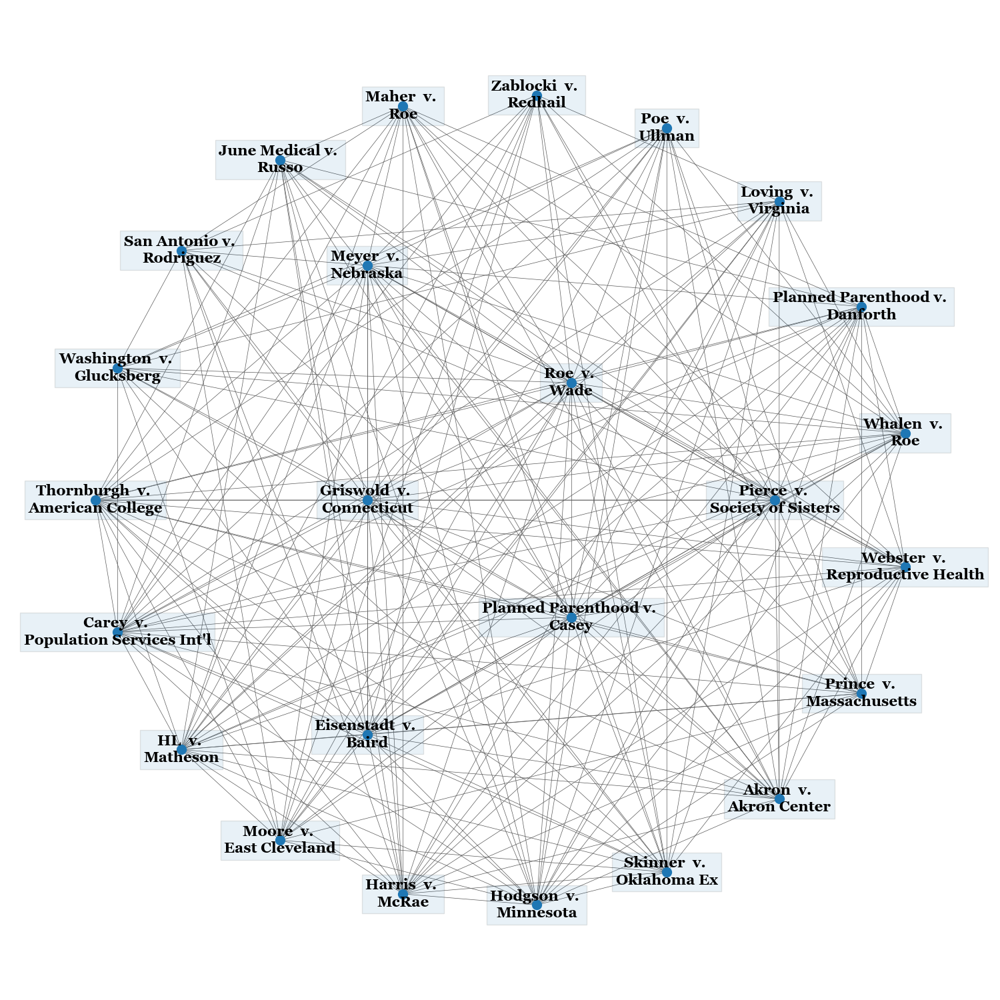

# Lexcaliber

Lexcaliber is an ongoing project to develop novel algorithms and analysis techniques for legal research.

Our current efforts include:
- Designing and assessing various recommendation algorithms to surface relevant court cases given a set of cases or textual content.
  - Building a search function for caselaw that marshals both textual content of the user's query and previously-identified relevant cases to display the most relevant results to the user.
- Scraping and analyzing [parentheticals](https://www.law.georgetown.edu/wp-content/uploads/2018/07/Parentheticals-Bluebook-Handout-Revision-Karl-Bock-2016.pdf) of legal citations to infer semantic content and relevance of cases to one other.
- Utilizing [graph embedding](https://en.wikipedia.org/wiki/Knowledge_graph_embedding) techniques to efficiently deliver recommendations and create intuitive visualizations.
- Clustering caselaw using network- and text-based approaches to understand the discrete issues presented by different parts of a given legal document.
- Empirically determining the degree of reliance on precedent  courts demonstrate in different jurisdictions and areas of the law by estimating the "predictability" of citation behavior.
- Designing a web interface that can be used by legal researchers to quickly discover and identify relevant caselaw using our systems.

See [Eksombatchai et. al (2017)](https://arxiv.org/abs/1711.07601), [Huang et. al (2021)](https://arxiv.org/abs/2106.10776), [Sun et. al (2016)](https://arxiv.org/pdf/1610.02906.pdf) for literature that informs our current approaches

Our current work is focused on the federal appellate corpus (all circuit courts as well as the Supreme Court), with the aim of building systems that generalize to other jurisdictions.

This repository contains the bulk of the logic and infrastructure powering this project, as well as command-line and REST interfaces. See [lexcaliber/explorer](https://github.com/lexcaliber/explorer) for more information about the prototype web interface we're building to demonstrate the technology.

## Results

The main thrust of our efforts so far has been in recommendation and discovery.
Given some information (a relevant case or two; key words or phrases; a document in progress) from the user, we would like to examine the ~1,000,000 document strong federal appellate corpus and recommend relevant opinions which aid the user’s research or argument.

### Methodology

Our initial results have been very promising.
The primary metric we are currently using is _recall_, the percentage of documents defined as relevant that we are successfully able to recommend.
We adopt the measurement approach taken by [Huang et. al (2021)](https://arxiv.org/abs/2106.10776).

1. We select a random opinion in the federal corpus and remove it from our network (as if the opinion never existed).
2. We input all but one of the opinion’s neighbors into the recommendation software.
3. We measure whether the omitted neighbor was the top recommendation, in the top 5 recommendations, or in the top 20 recommendations.

Our initial results are as follows: 

```
For 20 cases after 5  trials each:
        top1: 10.0%
        top5: 21.0%
        top20: 35.0%
Majority vote control for 20 cases after 5  trials each:
        top1: 0.0%
        top5: 0.0%
        top20: 0.0%
```

If we restrict the cases to those with at least five neighbors (reasonable, considering that there are many orders/slip opinions with no or few citations), our results are even better:
```
For 20 cases after 5  trials each:
        top1: 18.0%
        top5: 30.0%
        top20: 47.0%
Majority vote control for 20 cases after 5  trials each:
        top1: 0.0%
        top5: 0.0%
        top20: 0.0%
```

These results are comparable to Huang et. al. 2021 in light of the much larger federal appellate corpus and, in our view,
portend significantly more potential to generalize to other jurisdictions. We further expect these results to improve once
we consider textual citation context as part of our recommendation computation.

## Getting set up

1. Set PROJECT_PATH to the github directory, using .env or standard bashrc
2. Set a psql server hostname, port, and username + password if necessary in .env (making sure you create the empty database)
3. To set up the database schema, `alembic upgrade head`. Make sure you have a username in .env.
4. To install the CLI, run in the main project directory: `pip install --editable .` Run `lxc --help` for a list of all commands.
5. To populate your database with data from CourtListener, run `lxc data download` with your desired jurisdictions.
6. To run the API server: `lxc server run`

Bonus: Run `git config blame.ignoreRevsFile .git-blame-ignore-revs` so your `git blame` doesn't catch our reformatting commits.

## Migrations
- Run `alembic upgrade head` if your database schema is out of date.




